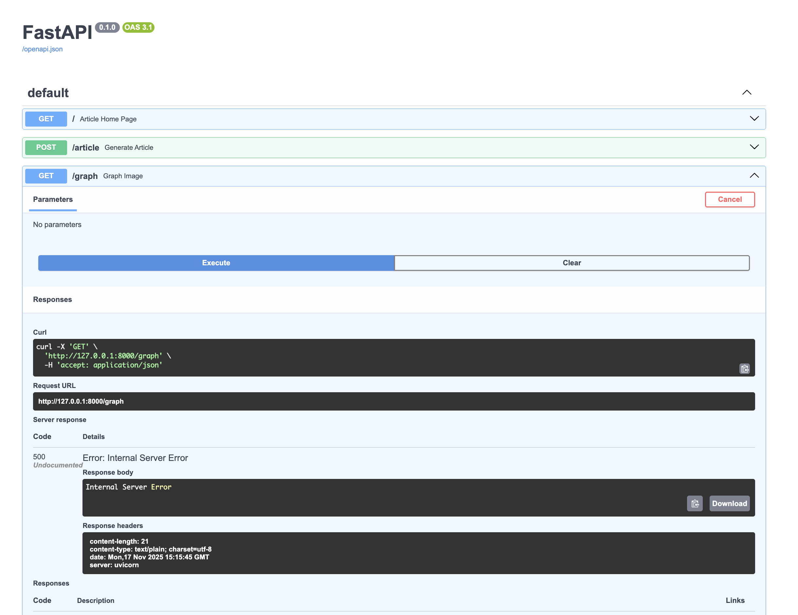
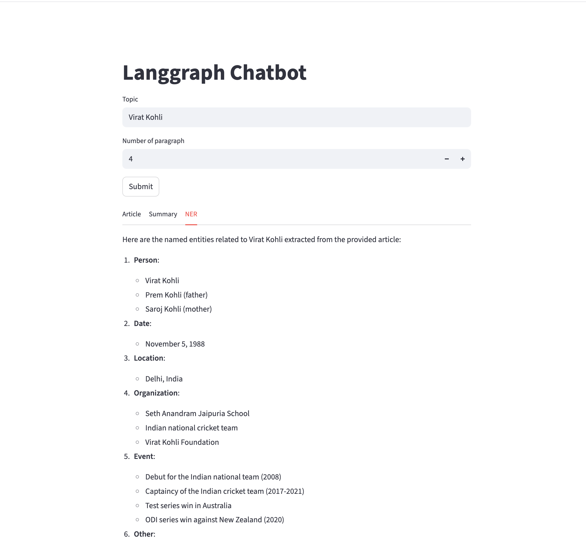

### The project deals with fastapi langgraph based llm application that generates an article, then based on the article, it generates summary and named entity recognition.

### Tech stack used:

1. Python FastAPI
2. Langgraph
3. Python streamlit
4. Python pydantic
5. GPT LLM
6. Python request and response

### FastAPI 

### Streamlit application 

