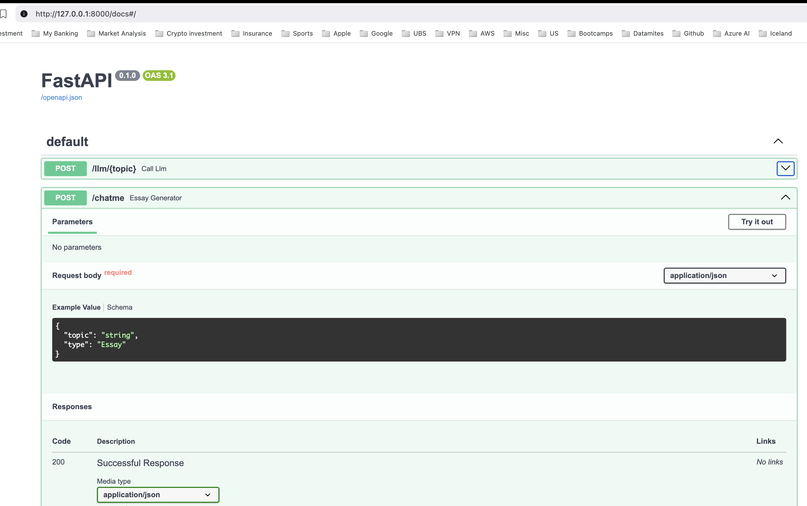
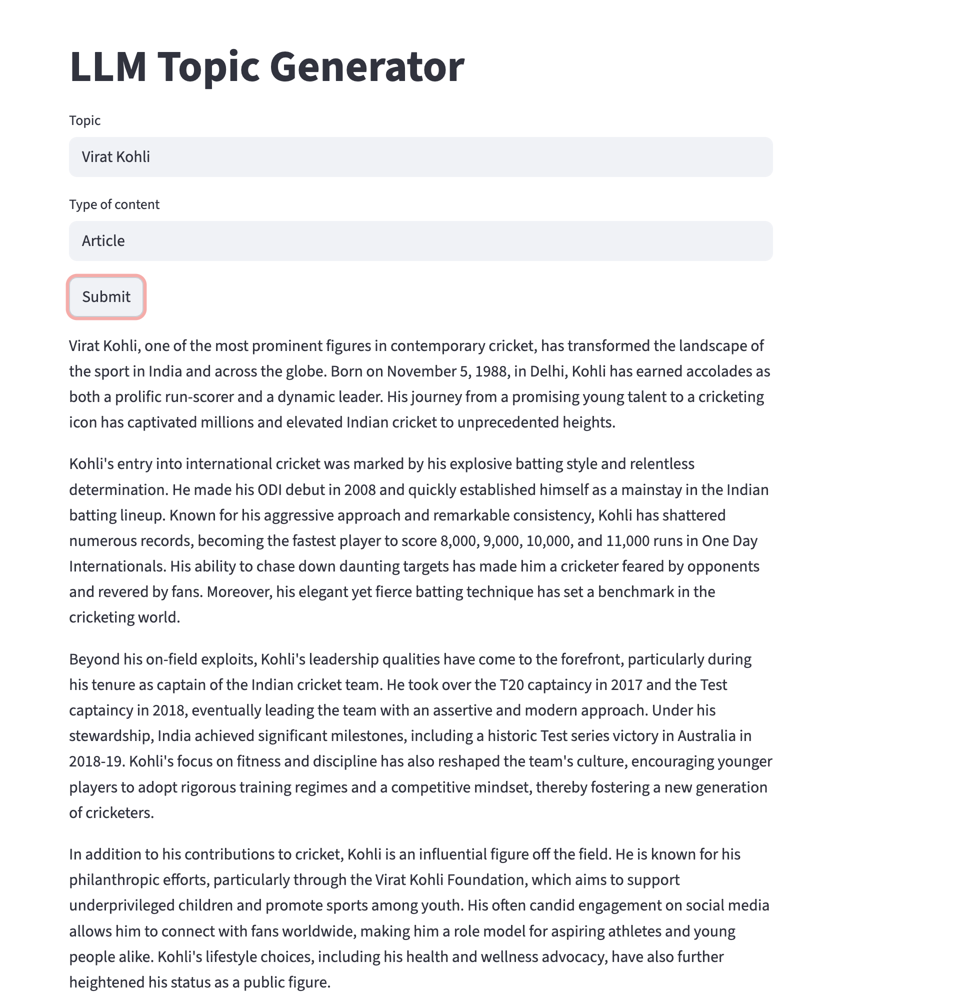

### The project deals with fastapi llm application that generates essay, article, Poem based on user selection for a topic.

### Tech stack used:

1. Python FastAPI
2. Langchain
3. Python streamlit
4. Python pydantic
5. GPT LLM

### FastAPI 

### Streamlit application 

