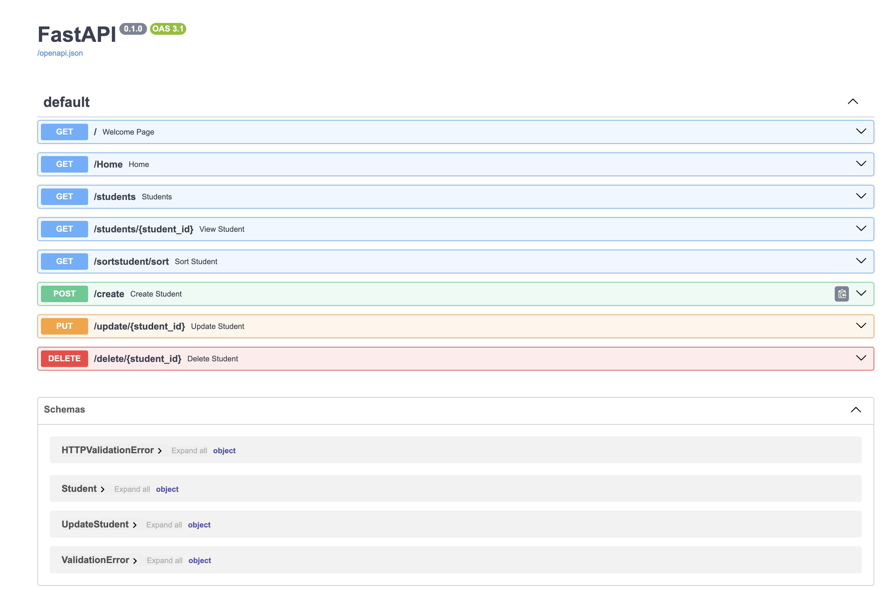
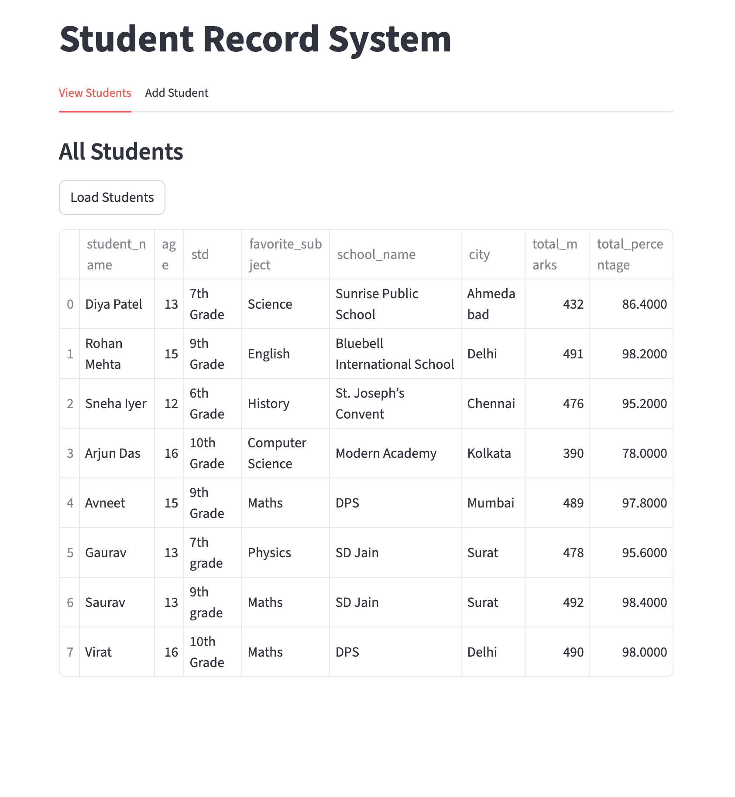

### The project deals student management system that allows you to do the CRUD operations.

### Tech stack used:

1. Python FastAPI
2. Langchain
3. Python streamlit
4. Python pydantic
5. GPT LLM

### FastAPI

### Streamlit application

