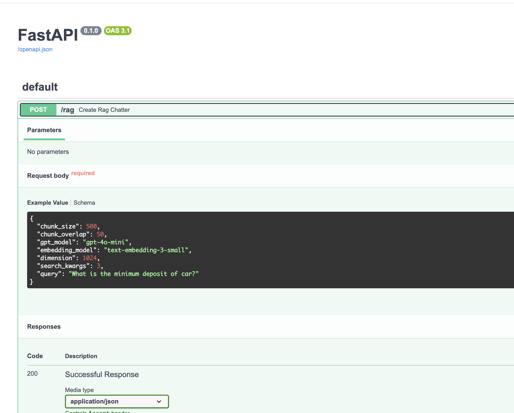
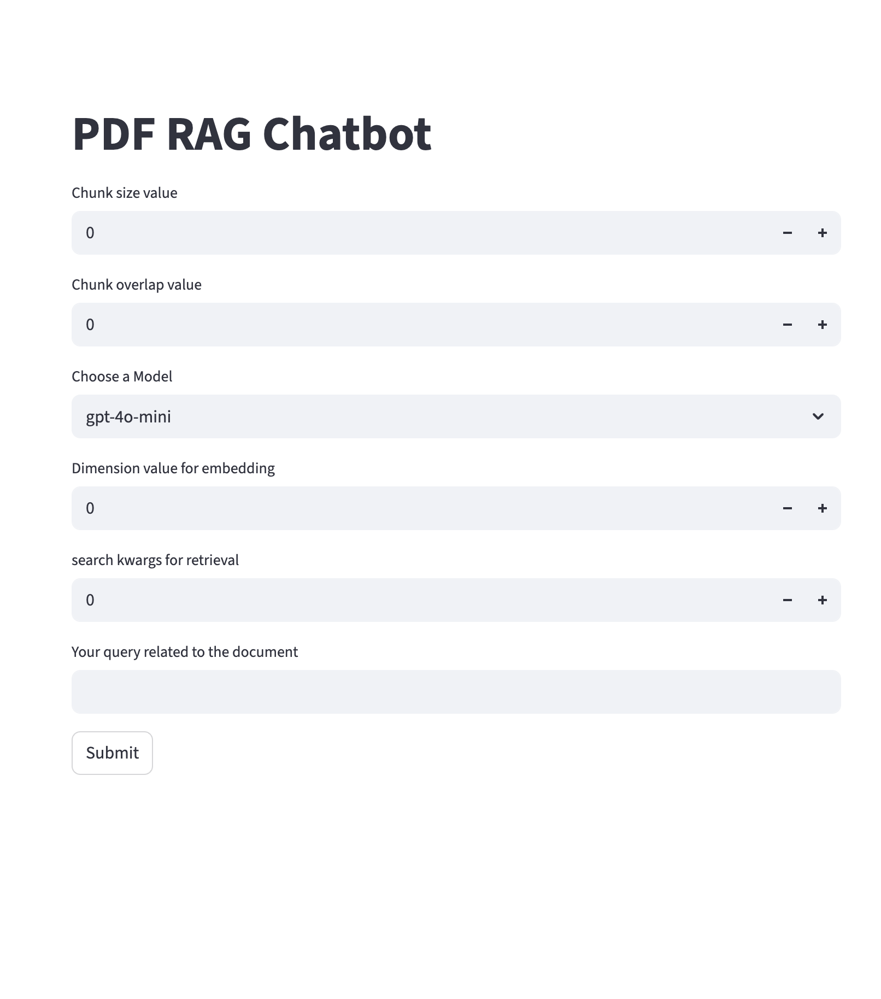

### The project deals with a RAG based application that asks user a general request body such as below and generates embedding and answers related to the questions:

1. Chunk size
2. Chunk overlap
3. gpt_model
4. embedding_model
5. dimension
6. search_kwargs
7. query

### Tech stack used:

1. Python FastAPI
2. Langchain
3. Python streamlit
4. Python pydantic
5. GPT LLM

### FastAPI

### Streamlit application

