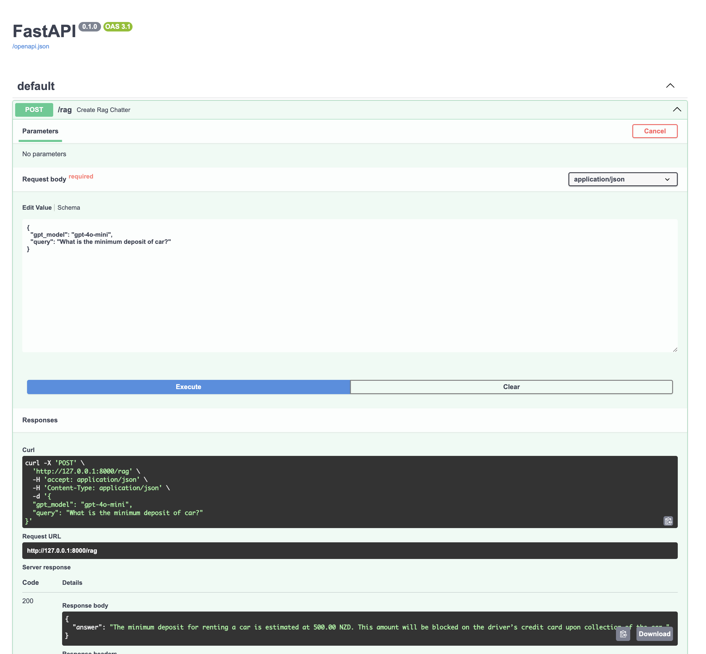
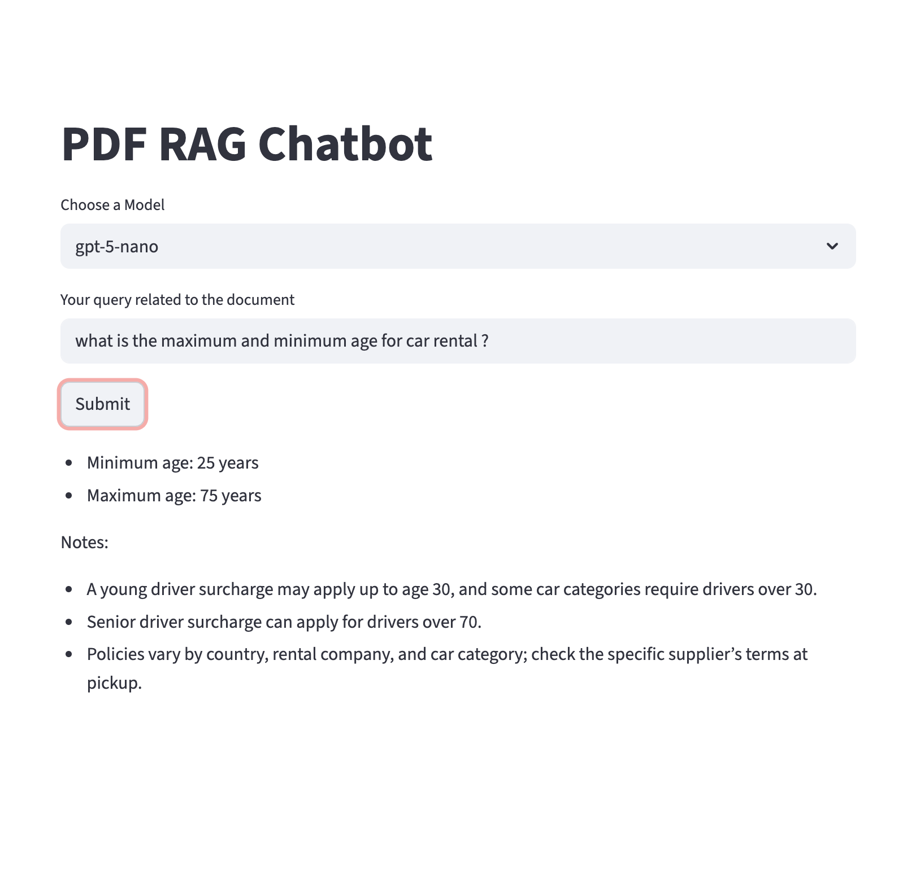

### This project is an enhancement of rag_chatbot project with a modular approach. User only has to provide below.

1) gpt_model
2) query

### Enhancements are as below:

1. Previous project had an issue with no DB disk for chroma store. Everytime, program is loaded, it will look for the local embeddings.
2. Everytime a question is asked, a whole re-embedding process will take place every single run. This time, embedding is kept outside of the route.
3. User to only provide gpt model and query instead of whole many fields.
4. Modular approach to have segregated modules for pydantic schema, llm, frontend, embedding, vector store

### Tech stack used:

1. Python FastAPI
2. Langchain
3. Python streamlit
4. Python pydantic
5. GPT LLM

### FastAPI

### Streamlit application
